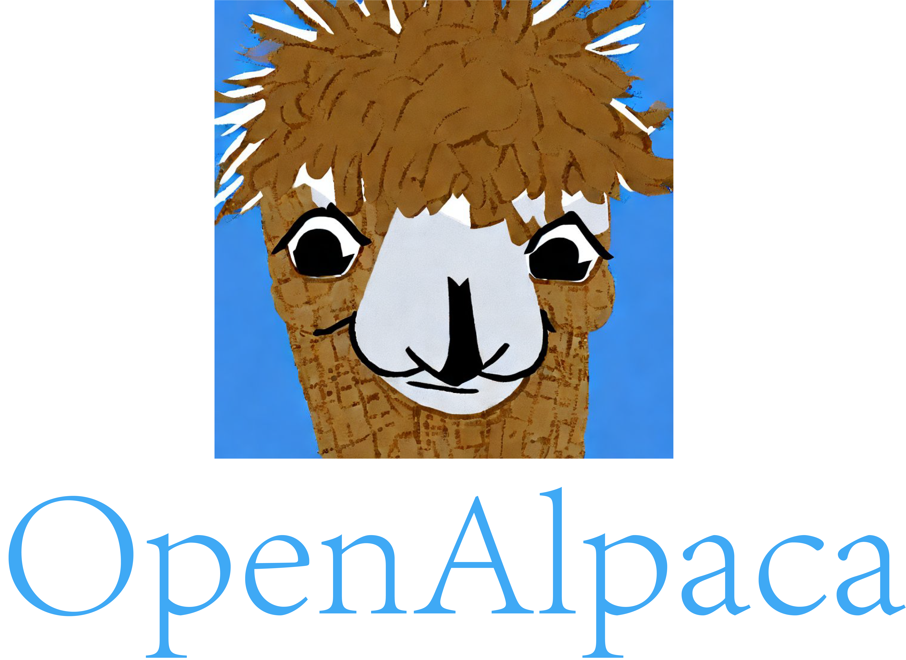

<p align="center" width="100%">

</p>

# OpenAlpaca: A Fully Open-Source Instruction-Following Model Based On OpenLLaMA


**Team:** [Yixuan Su](https://yxuansu.github.io/)<sup>\*</sup>, [Tian Lan](https://github.com/gmftbyGMFTBY)<sup>\*</sup>, and [Deng Cai](https://jcyk.github.io/) (The first two members<sup>\*</sup> contributed equally.)

This is the repo for the OpenAlpaca project, which aims to build and share an instruction-following model based on [OpenLLaMA](https://github.com/openlm-research/open_llama). We note that, following OpenLLaMA, OpenAlpaca is permissively licensed under [the Apache 2.0 license](https://www.apache.org/licenses/LICENSE-2.0). We also highlight that the training of OpenAlpaca only takes around **30** minutes on 8xA100 GPUs.

This repo contains
- The <a href='#weights'>weights</a> for the fine-tuned model.
- The <a href='#data'>data</a> used for fine-tuning the model.
- The <a href='#example_usage'>example usage</a> of OpenAlpaca.
- The <a href='#code'>code</a> for fine-tuning the model.

**Usage and License Notices:** OpenAlpaca follows the distribution permission of [OpenLLaMA](https://github.com/openlm-research/open_llama), i.e. the Apache 2.0 license, which means OpenAlpaca can be used in any academic or commercial purposes for free.

****

# News:
* [2023/05/06] Release the training code and the OpenAlpaca model based on the OpenLLaMA model trained with 300 billion tokens.
* [2023/05/04] The project of OpenAlpaca is open-sourced. Release the OpenAlpaca model based on the OpenLLaMA model trained with 200 billion tokens.

****

<span id='weights'/>

# Model Weights:

|**Model Name**|**Model Card**|**Model Description**|
|:-------------:|:-------------:|:-------------:|
|`openllmplayground/openalpaca_7b_preview_2bt`|[[Link]](https://huggingface.co/openllmplayground/openalpaca_7b_preview_2bt/)|```The OpenAlpaca model fine-tuned from the previewed version of OpenLLaMA that is trained with 200 billion tokens.```|
|`openllmplayground/openalpaca_7b_preview_3bt`|[[Link]](https://huggingface.co/openllmplayground/openalpaca_7b_preview_3bt/)|```The OpenAlpaca model fine-tuned from the previewed version of OpenLLaMA that is trained with 300 billion tokens.```|

<span id='data'/>

# Data:

The data, i.e. [openalpaca.json](https://github.com/yxuansu/OpenAlpaca/blob/main/openalpaca.json), we use to fine-tune the model contains ~15k instances and is constructed from the [databricks-dolly-15k dataset](https://huggingface.co/datasets/databricks/databricks-dolly-15k) by removing samples that are too long. Following the original databricks-dolly-15k dataset, our data is also licensed under [the CC BY-SA 3.0 license](https://repositories.lib.utexas.edu/bitstream/handle/2152/11616/license_text?sequence=2&isAllowed=y) which allows it to be used in any academic and commerical purposes. 

**Format:** Following [Stanford Alpaca](https://github.com/tatsu-lab/stanford_alpaca), our json file is a list of dictionaries, each one contains the following fields.
- `instruction`: it describes the task the model should perform.
- `input`: optional context or input for the task (e.g. the document for summarization task). 
- `output`: the answer to the instruction (and the optional input) which is written by human.

We use the following prompts to fine-tune the OpenAlpaca model:
- for examples with an empty input field:
```
### Instruction:
{instruction}

### Response:
```

- for examples with a non-empty input field:
```
### Input:
{input}

### Instruction:
{instruction}

### Response:
```

**Reproduce the data:** To reproduce the data, simply run `python3 process_dataset.py`.

<span id='example_usage'/>

# Example Usage:

**[Note]** We would like to note that, unlike LLaMA, OpenAlpaca uses the token id of **1** as the bos (begining of the sequence) token. This follows the definition of OpenLLaMA. Please refer to the authors' [orginal implementations](https://github.com/openlm-research/open_llama#preview-weights-release-and-usage) for more information.

Below shows an example on how to use OpenAlpaca.

```python
import torch
from transformers import LlamaForCausalLM, LlamaTokenizer

# the previewed version of OpenAlpaca
model_path = r'openllmplayground/openalpaca_7b_preview_2bt' 
tokenizer = LlamaTokenizer.from_pretrained(model_path)
model = LlamaForCausalLM.from_pretrained(model_path).cuda()

# same prompt as provided in https://crfm.stanford.edu/2023/03/13/alpaca.html
instruction = r'What is an alpaca? How is it different from a llama?'
'''
instruction = r'Write an e-mail to congratulate new Standford admits and mention that you are excited about meeting all of them in person.'
instruction = r'What is the capital of Tanzania?'
instruction = r'Write a well-thought out abstract for a machine learning paper that proves that 42 is the optimal seed for training neural networks.'
'''

prompt_no_input = f'### Instruction:\n{instruction}\n\n### Response:'
tokens = tokenizer.encode(prompt_no_input)
bos_token_id, eos_token_id = 1, 2 # see https://github.com/openlm-research/open_llama#preview-weights-release-and-usage
tokens = [bos_token_id] + tokens + [eos_token_id] + [bos_token_id]
tokens = torch.LongTensor(tokens[-1024:]).unsqueeze(0).cuda()
instance = {'input_ids': tokens,
            'top_k': 50,
            'top_p': 0.9,
            'generate_len': 128}
            
length = len(tokens[0])
with torch.no_grad():
    rest = model.generate(
            input_ids=tokens, 
            max_length=length+instance['generate_len'], 
            use_cache=True, 
            do_sample=True, 
            top_p=instance['top_p'], 
            top_k=instance['top_k']
        )

output = rest[0][length:]
string = tokenizer.decode(output, skip_special_tokens=False)
string = string.replace('<s>', '').replace('</s>', '').strip()
print(f'[!] Generation results: {string}')
```

**[Model Output]**
```
[!] Generation results: An alpaca is a smaller version of a llama. Both are South American animals. However, 
an alpaca has a wooly coat that is very soft, while a llama’s coat is tougher and woolier.
```


<span id='future_plans'/>

<span id='code'/>

# Fine-tuning the Model:

## 1. Environment Setup:

The fine-tuning of OpenAlpaca takes on a machine with 8xA100 (40G) GPUs and a CUDA version of 11.7.

To install the required environment, simply run the following command.
```yaml
pip install -r requirements.txt
```

If any error occurs when installing torch, you can install torch manually with the command below.
```yaml
pip install torch==1.13.1+cu117 -f https://download.pytorch.org/whl/torch/
```

## 2. Download OpenLLaMA checkpoints:

Before training OpenAlpaca, please manually downloading the checkpoints of OpenLLaMA from huggingface and place the downloaded files in the [./openllama_ckpt](./openllama_ckpt) directory. Below are the links of available OpenLLaMA models.
- The previewed version of [OpenLLaMA trained with 200 billion tokens](https://huggingface.co/openlm-research/open_llama_7b_preview_200bt/tree/main/open_llama_7b_preview_200bt_transformers_weights).
- The previewed version of [OpenLLaMA trained with 300 billion tokens](https://huggingface.co/openlm-research/open_llama_7b_preview_300bt/tree/main/open_llama_7b_preview_300bt_transformers_weights).

> **** After downloading, the directory should look like:

    .
    └── ./openllama_ckpt/             
        ├── config.json
        ├── generation_config.json
        ├── pytorch_model-00001-of-00002.bin
        ├── pytorch_model-00002-of-00002.bin
        ├── pytorch_model.bin.index.json
        ├── special_tokens_map.json
        ├── tokenizer.model
        └── tokenizer_config.json

## 3. Model Training:

In our experiments, we train our model using DeepSpeed with Zero-3 on 8xA100 GPUs. To start the training, run the following command. The entire training process should take around 30 minutes.
```yaml
./scripts/train_sft.sh
```
The key arguments of the training script are as follows:
* `--model_path`: The directory (e.g. [./openllama_ckpt](./openllama_ckpt)) that stores the downloaded checkpoints of OpenLLaMA.
* `--data_path`: The path of training data.
* `--save_path`: The path to save the fine-tuned OpenAlpaca checkpoint.

The table below shows the hyperparameters of the learning process.

|**Hyperparameter**|**Value**|
|:-------------:|:-------------:|
|Batch size|64|
|Learning rate|2e-5|
|Epochs|2|
|Maximum length|1024|

The `batch_size` and `learning_rate` can be adjusted in [./dsconfig/openllama.json](./dsconfig/openllama.json). The `epoch_number` and `maximum_length` can be adjusted in [./config/openllama.yaml](./config/openllama.yaml).

After the training completes, you find the tokenizer, configuration, and deepspeed checkpoints in `--save_path`. Running the following command to convert the deepspeed checkpints to torch models.
```yaml
python {--save_path}/zero_to_fp32.py {--save_path} {--save_path}/pytorch_model.bin
```
Then, you can find the torch model `pytorch_model.bin` in `--save_path`.

The resulting checkpoint `pytorch_model.bin` is quite large. If you would like to split it into multiple shards, you can run the command below.
```yaml
./scripts/make_shards.sh
```

> **** After spliting, the directory of saved checkpoints should look like:

    .
    └── ./ckpt/openalpaca/             
        ├── config.json
        ├── generation_config.json
        ├── pytorch_model-00001-of-00006.bin
        ├── pytorch_model-00002-of-00006.bin
        ├── pytorch_model-00003-of-00006.bin
        ├── pytorch_model-00004-of-00006.bin
        ├── pytorch_model-00005-of-00006.bin
        ├── pytorch_model-00006-of-00006.bin
        ├── pytorch_model.bin.index.json
        ├── special_tokens_map.json
        ├── tokenizer_config.json
        └── tokenizer.model
        
Now the model is good to go! Enjoy playing with OpenAlpaca!

# Future Plans:

1. The current `openalpaca_7b_preview_2bt` model is fine-tuned on the previewed version of [OpenLLaMA-7b](https://github.com/openlm-research/open_llama). The previewed version of OpenLLaMA-7b is only trained with **200** billion tokens and we expect the performance of the base OpenLLaMA-7b model to improve as the training continues. We will update the version of OpenAlpaca so long as newer checkpoint is released by the authors of OpenLLaMA.

2. We also plan to do a rigorous evaluation of OpenAlpaca and compare it with other publicly accessible models.

<span id='reference'/>

# Reference:

If you found OpenAlpaca useful in your research or applications, please kindly cite using the following BibTeX:
```
@misc{openalpaca,
  author = {Yixuan Su and Tian Lan and Deng Cai},
  title = {OpenAlpaca: A Fully Open-Source Instruction-Following Model Based On OpenLLaMA},
  year = {2023},
  publisher = {GitHub},
  journal = {GitHub repository},
  howpublished = {\url{https://github.com/yxuansu/OpenAlpaca}},
}
```
```
@software{openlm2023openllama,
  author = {Xinyang Geng and Hao Liu},
  title = {OpenLLaMA: An Open Reproduction of LLaMA},
  month = May,
  year = 2023,
  url = {https://github.com/openlm-research/open_llama}
}
```
```
@misc{alpaca,
  author = {Rohan Taori and Ishaan Gulrajani and Tianyi Zhang and Yann Dubois and Xuechen Li and Carlos Guestrin and Percy Liang and Tatsunori B. Hashimoto },
  title = {Stanford Alpaca: An Instruction-following LLaMA model},
  year = {2023},
  publisher = {GitHub},
  journal = {GitHub repository},
  howpublished = {\url{https://github.com/tatsu-lab/stanford_alpaca}},
}
```
```
@article{touvron2023llama,
  title={Llama: Open and efficient foundation language models},
  author={Hugo Touvron and Thibaut Lavril and Gautier Izacard and Xavier Martinet and Marie{-}Anne Lachaux and Timoth{\'{e}}e Lacroix and Baptiste Rozi{\`{e}}re and Naman Goyal and Eric Hambro and Faisal Azhar and Aur{\'{e}}lien Rodriguez and Armand Joulin and Edouard Grave and Guillaume Lample},
  journal={arXiv preprint arXiv:2302.13971},
  year={2023}
}
```

<span id='acknowledgements'/>

# Acknowledgements:

This repo benefits from [OpenLLaMA](https://github.com/openlm-research/open_llama), [Alpaca](https://github.com/tatsu-lab/stanford_alpaca), and [Databricks](https://www.databricks.com/). Thanks for their wonderful works!
